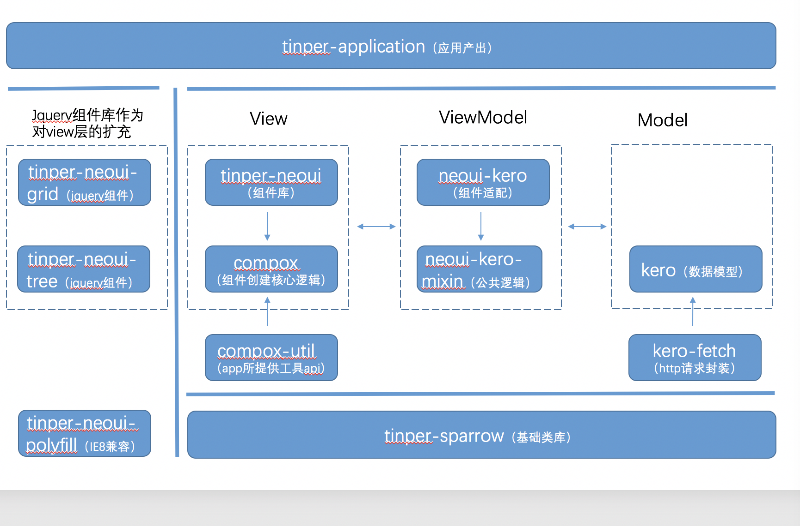
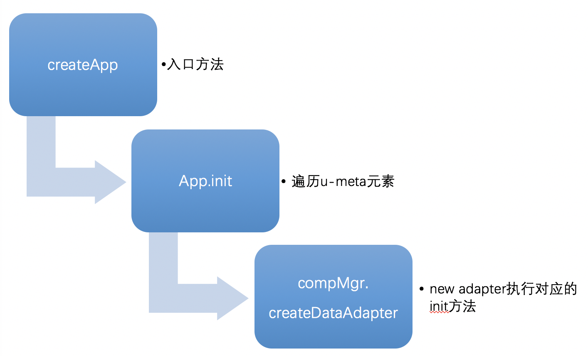

# 1、框架仓库结构说明

## 框架基础

* tinper-sparrow：提供框架基础api
## View
* compox：框架创建组件的核心逻辑，主要包括compMgr以及createApp

* tinper-neoui：基于compox规范定义各个UI组件

* compox-util：app所提供的工具api，方便功能开发人员进行操作

## Model

* kero：做为MVVM架构中Model层的增强，提供多维数据模型
* kero-fetch：主要提供与服务器交互时所需的方法，需和后台数据模型联合使用

## ViewModel

* neoui-kero：针对各个组件进行适配
* neoui-kero-mixin：对neoui-keo适配层的公共逻辑进行提取，neoui-kero中可根据需要添加对应的mixin
## 框架扩充
* tinper-neoui-grid：基于jquery实现的grid组件
* tinper-neoui-tree：第三方tree插件 ztree
* tinper-neoui-polyfill：IE8兼容处理

# 2、核心API说明

## 2.1、基类class
所有的js对象都继承自class

new对象时都会调用initialize方法，UI组件基类BaseComponent与u-meta组件基类BaseAdapter的initialize方法中都会调用init方法，因此各个组件需要将init作为入口方法并进行实现

## 2.2、UI组件
### UI组件注册
* CompMgr.regComp：注册UI组件，将comp与css进行关联
### UI组件解析过程
* CompMgr.updateComp：针对页面的css进行解析，生成UI组件，最终调用组件的init方法
## 2.3、u-meta组件
### u-meta组件注册解析过程
* CompMgr.addDataAdapter：注册适配层，将compAdapter于type进行关联
### u-meta组件解析过程
u-meta组件解析过程说明图

* createApp：针对页面的u-meta进行解析，生成组件并与datatable进行绑定
* app.init：针对页面的u-meta进行解析的核心方法，遍历所有的u-meta元素调用compMgr.createDataAdapter生成每个组件
* compMgr.createDataAdapter：针对传入的type级u-meta属性new对应的adapter，最终调用组件的init方法

## 2.4、mixin说明
neoui-kero-mixin仓库对neoui-kero适配层的公共逻辑进行提取
* BaseAdapter中默认添加了ValueMixin,EnableMixin, RequiredMixin, ValidateMixin，如果新增组件有特殊需求可通过自定义mixins属性来调整添加的mixin
* BaseAdapter中的initialize方法会将mixin中的methods添加至当前组件，并且在方法最后会调用mixin的init方法进行初始化

### ValueMixin
处理数据在tinper-neoui与kero之间的交互操作。以下对核心API进行说明：
* modelValueChange：数据模型改变时执行的方法，可针对实际情况在各组件中重写
* setShowValue：modelValueChange中对数据格式化之后调用此方法修改UI层的战士，可针对实际情况在各组件中重写
* setValue：UI层改变时执行的方法，提供接口beforeSetValue并在setValue最开始调用，可针对实际情况在各组件中重写beforeSetValue以便对数据进行格式化等操作
### EnableMixin
根据u-meta中的enable属性传入UI层，并监听datatable的Enable属性变化。以下对核心API进行说明：
* setEnable：设置UI层的enable展示，可针对实际情况在各组件中重写

### RequiredMixin
根据u-meta中的required属性传入UI层，并监听datatable的required属性变化。以下对核心API进行说明：
* setRequired：设置UI层的必输展示，可针对实际情况在各组件中重写

### ValidateMixin
根据datatable或u-meta中的校验属性定义来生成校验组件，并没有监听datatable中的属性变化，后续考虑优化。以下对核心API进行说明：
* doValidate：调用当前组件的数据校验